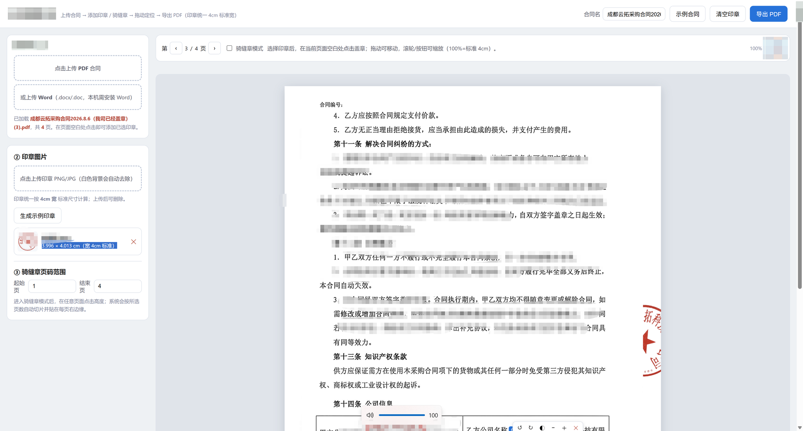
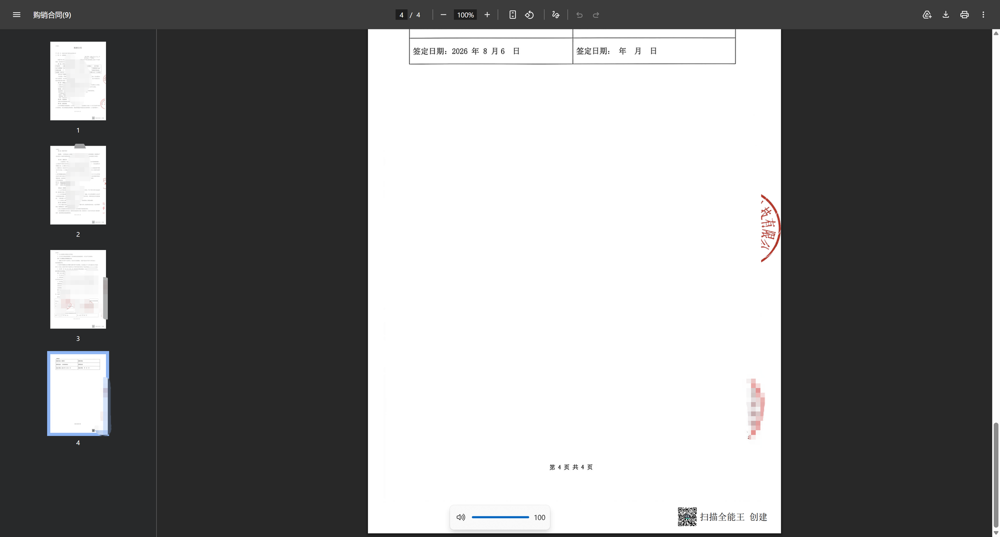

# 电子印章服务 | byc-e-seal

> **[渤溢云拓 · 企业阿辅](https://www.afuhub.com) — 中小企业经营决策 AI 大脑，您的专属企业智能体外脑 →**

A local-run electronic seal service for PDF/Word contracts. Upload a contract, place seals (including cross-page "rider seals"), adjust position / size / rotation / opacity, and export a stamped PDF.

渤溢云拓科技有限公司开发的本地电子盖章工具。上传 PDF 或 Word 合同，添加普通印章或骑缝章，自由调整位置、大小、旋转角度和透明度，最后导出带章 PDF。

> 默认仅在本机运行，合同和印章不会上传到第三方服务。
> By default this runs locally. Contracts and seal images are not sent to any third party.

## Features 功能

| 中文 | English |
| --- | --- |
| 上传 PDF 合同并逐页预览 | Upload PDF contract with page-by-page preview |
| 上传 Word（.docx/.doc）自动转 PDF | Upload Word (.docx/.doc) and auto-convert to PDF |
| 上传 PNG/JPG 印章图片 | Upload PNG/JPG seal images |
| 自动去除白色背景 | Auto-remove white background |
| 印章统一按 **4 cm** 标准宽处理 | Seals normalized to **4 cm** standard width |
| 普通章：点击定位、拖动、缩放、旋转、透明度 | Regular seal: click to place, drag, resize, rotate, opacity |
| 骑缝章：选择页码范围，自动切片贴到每页右边缘 | Rider seal: select page range, auto-slice across all pages |
| 骑缝章切片同步拖动 / 缩放 / 删除 | Synchronized drag / resize / delete for all rider-seal slices |
| 导出保留原始页面尺寸的带章 PDF | Export stamped PDF preserving original page sizes |
| 生成示例合同 / 示例印章 | Generate sample contract / sample seal |

## 免安装版（傻瓜包） / Windows One-Click Build

> 不想装 Python？**下载 `byc-e-seal.exe`（约 33 MB）双击即用：**
>
> - GitHub Releases（推荐）：[byc-e-seal.exe](https://github.com/vic-998/byc-e-seal/releases/latest/download/byc-e-seal.exe) — 含 v1.0.0 傻瓜包
> - 码云 Gitee Releases（国内更快）：[byc-e-seal.exe](https://gitee.com/boyicloud/byc-e-seal/releases/download/v1.0.0/byc-e-seal.exe)
> - 仓库直链（备用）：[release/byc-e-seal.exe](https://github.com/vic-998/byc-e-seal/raw/main/release/byc-e-seal.exe)
> Python / Flask / Pillow / pypdf / ReportLab 全部打包在内，无需任何环境，自动打开浏览器。
>
> **No Python? Download the single executable — everything is bundled. Double-click and it opens in your browser.**
>
> 注意 / Notes：
> - 首次运行请允许 Windows 防火墙访问（本机环回地址，安全）。
> - Word 转 PDF 仍需本机安装 Microsoft Word（Windows 功能）。
> - exe 为 Windows x64 构建；macOS / Linux 请走下方源码安装。

## Screenshots 使用截图

**使用界面 / Web UI** — 上传合同、选择印章、骑缝章定位：

<p align="center"></p>

**导出效果 / Exported PDF** — 骑缝章已切片贴到每页右边缘：

<p align="center"></p>

## Quick Start 快速开始

Requirements 环境要求：

- Python 3.10+
- Windows / macOS / Linux（PDF 功能）
- Windows + Microsoft Word + `comtypes`（仅 Word 转 PDF 需要）
- No build tools needed; PDF.js is bundled in `static/`

```bash
git clone https://github.com/vic-998/byc-e-seal
cd byc-e-seal
python -m venv .venv

# Windows PowerShell
.\.venv\Scripts\Activate.ps1
# macOS / Linux
# source .venv/bin/activate

pip install -r requirements.txt
python app.py
```

Open: http://127.0.0.1:8765/

自定义端口：`$env:PORT=9000` (Windows) / `PORT=9000 python app.py` (macOS/Linux)

## Usage 使用说明

1. **上传合同** — 拖入 PDF，或上传 Word（需本机安装 Microsoft Word）。
2. **上传印章** — PNG/JPG，白色背景自动去除；或点击"生成示例印章"。
3. **普通章** — 在页面空白处点击盖章，拖动调整位置，滚轮缩放，按钮旋转 / 调透明度，双击复制。
4. **骑缝章** — 开启"骑缝章模式"，设置起止页码，在页面点击目标高度；系统按页数自动切片贴到右边缘。
5. **导出** — 点击"导出 PDF"，文件名可在顶部"合同名"修改。

100% 缩放 = 导出 PDF 中 4 cm 真实宽度。

## Tech Stack 技术栈

- Python 3 / Flask
- Pillow (image processing)
- pypdf (PDF assembly)
- ReportLab (sample contract generation + stamp overlay)
- PDF.js (client-side rendering)
- comtypes (Word COM, Windows only)

## Project Structure 项目结构

```
.
├── app.py                 # Flask server, seal processing, PDF export
├── templates/
│   └── index.html         # UI + all frontend logic
├── static/
│   ├── pdf.min.mjs
│   └── pdf.worker.min.mjs
├── tools/                 # dev/test scripts
├── requirements.txt
├── files/                 # runtime (gitignored)
└── seals/                 # runtime (gitignored)
```

## API

| Method | Path | Description |
| --- | --- | --- |
| `GET` | `/` | Main page |
| `POST` | `/api/pdf` | Upload PDF |
| `POST` | `/api/word2pdf` | Upload Word → PDF |
| `POST` | `/api/seal` | Upload & process seal image |
| `POST` | `/api/sample` | Generate sample contract |
| `POST` | `/api/sample-seal` | Generate sample seal |
| `POST` | `/api/export` | Merge stamps & export PDF |

## Rider Seal 骑缝章原理

The full seal image is split horizontally into N equal vertical slices (N = number of pages in the selected range). Each slice is pasted at the right edge of its respective page at the same vertical center. All slices in the same group move, scale, fade, and delete together.

完整印章按所选页数横向等分为 N 片，每片贴在对应页右边缘、同一垂直高度。同一组的切片同步移动、缩放、调透明度或删除。

## Deployment 部署说明

`python app.py` 启动的是 Flask 开发服务器，不适合直接暴露公网。生产部署建议：

- Waitress / Gunicorn 等 WSGI 服务
- 用户认证 + 文件隔离
- HTTPS、CSRF、频率限制
- 文件过期清理

## Legal Disclaimer 法律声明

本项目实现的是"在 PDF 页面上叠加印章图片"，不等同于基于 CA 数字证书的电子签名。请仅在获得授权并符合当地法律的情况下使用。项目作者不对违法使用或不当使用承担责任。

This project overlays seal images onto PDF pages. It is NOT a certified digital signature solution. Only use with proper authorization and in compliance with applicable laws.

## Contributing 参与贡献

欢迎提交 Issue 和 Pull Request。请勿附带真实合同、真实印章或任何敏感文件。

## Contact 联系

- Company 公司：渤溢云拓科技有限公司
- Email 邮箱：caoxin@boyicloud.email
- 企业阿辅（中小企业经营决策 AI 大脑）：https://www.afuhub.com

## License 许可证

MIT License

Copyright (c) 2026 渤溢云拓科技有限公司 (Boyi Yuntuo Technology Co., Ltd.)

Permission is hereby granted, free of charge, to any person obtaining a copy of this software and associated documentation files (the "Software"), to deal in the Software without restriction, including without limitation the rights to use, copy, modify, merge, publish, distribute, sublicense, and/or sell copies of the Software, and to permit persons to whom the Software is furnished to do so, subject to the following conditions:

The above copyright notice and this permission notice shall be included in all copies or substantial portions of the Software.

THE SOFTWARE IS PROVIDED "AS IS", WITHOUT WARRANTY OF ANY KIND, EXPRESS OR IMPLIED, INCLUDING BUT NOT LIMITED TO THE WARRANTIES OF MERCHANTABILITY, FITNESS FOR A PARTICULAR PURPOSE AND NONINFRINGEMENT. IN NO EVENT SHALL THE AUTHORS OR COPYRIGHT HOLDERS BE LIABLE FOR ANY CLAIM, DAMAGES OR OTHER LIABILITY, WHETHER IN AN ACTION OF CONTRACT, TORT OR OTHERWISE, ARISING FROM, OUT OF OR IN CONNECTION WITH THE SOFTWARE OR THE USE OR OTHER DEALINGS IN THE SOFTWARE.
